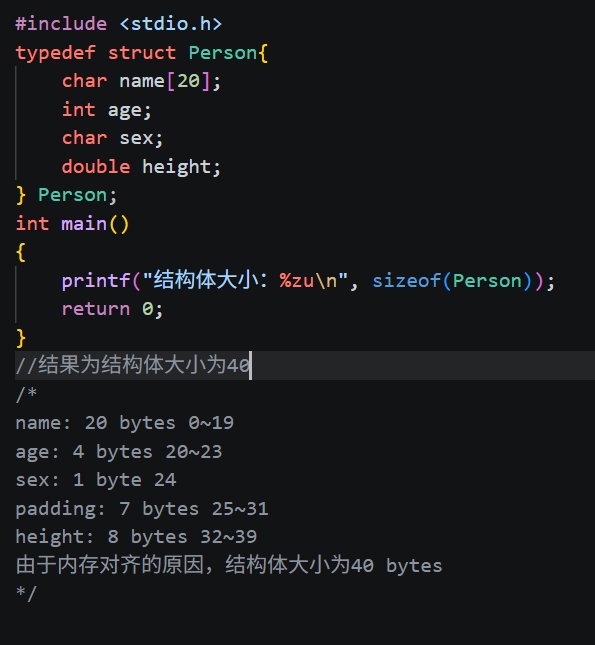
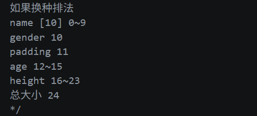
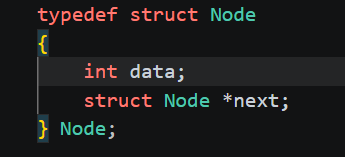
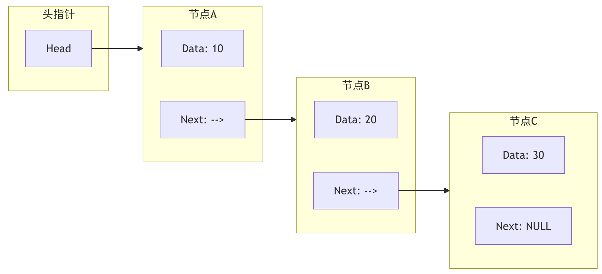
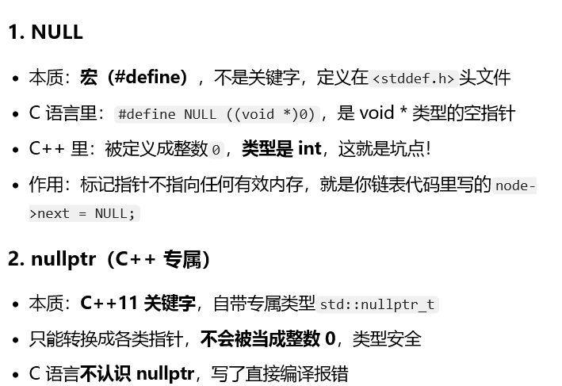

# GLIMMER-CS-EASY-02
微光工作室招新题2

## step1

1. 定义指针变量

格式：`类型名 *指针变量名;`

指针大小

指针变量**本身大小固定，和它指向什么类型无关，只由当前系统的地址总线 / 操作系统位数决定**：

- 32 位系统：**4 字节**
- 64 位系统： **8 字节**

> 
> 指针存储的是内存地址，地址的宽度由系统寻址

(CPU 能够访问到的全部内存地址编号的集合,32 位地址总线：\(2^{32} = 4294967296\) 个地址 = **4GB 寻址空间**.

寻址空间 ≥ 物理内存(ram)；寻址空间里还会划分一部分给外设（显卡、BIOS、寄存器）)

空间决定，不是由指向的数据类型决定.

2. 答案：20，10

`*p`解引用，修改地址内的值

- 数组名`arr`等价于首元素`&arr[0]`

- `++*arr`： `++(*arr)`
`*arr` 就是`arr[0] =3`；`++`前置自增 → `arr[0] =4`，表达式值 = 4
- `*++q`：`*(++q)`
`++q`：指针 q 先自增，指向`arr[1]`（值 6）；再解引用，取出 6

3. 野指针

指针变量保存了一个非法、不确定的内存地址，不是 NULL，也不是有效可用内存的地址。（被声明但未初始化赋值的指针会指向随机的内存空间，可能导致未知的问题）

危害

1. 访问野指针会触发[^段错误]，程序直接崩溃；
2. 写入野指针，会**篡改未知内存**，覆盖其他变量、栈、堆数据，产生随机、难以复现的 bug；

[^段错误]:程序访问了它没有权限访问的内存地址，操作系统直接kill程序

2. 结构体指针

存放一个结构体变量在内存中的起始地址。
通过结构体指针访问成员要用 `->` 运算符。

3. 内存对齐规则：

- 每个成员的起始地址，必须是**自身类型大小的整数倍**
- 结构体整体大小，必须是**最大成员大小的整数倍**（这里最大成员是 double，占 8 字节）

## 2. 对比几个常用占位符

- `%d` → `int`（有符号整型）
- `%u` → `unsigned int`
- `%zu` → `size_t`（sizeof 返回值，标准推荐）

## step2

1. 
- 数组：连续存储，大小固定，索引访问
- 链表：动态大小，插入和删除比较方便，顺序访问，内存有指针开销

2. 单向链表的特点

- 每个节点由数据域和指针域构成
- 节点只指向下一个节点（双向链表节点同时指向前一个和后一个节点）

3. 操作实现
-`malloc(size)`：**堆内存申请函数**，`stdlib.h`里面的。向操作系统申请一块指定大小的内存，返回`void*`类型（通用指针）。
- 结构体普通变量：`n1.data`
  
  结构体指针：`Node*p;p->data=10;`
- `malloc` 本身**是函数**
函数调用会返回一个地址，**等号是把这个返回出来的地址，存进指针变量里面**。申请内存这件事，是`malloc()`函数内部做的；`=` 接收返回值。

4. 我的一些学习中的疑问
- 头结点：堆上`malloc`出来的结构体（真实节点，哨兵，不存有效数据）
- 头指针：栈上的指针变量，只存头结点的地址
- 为什么要有头节点

（1）情况 A：不带头结点（你觉得更自然的方案）

链表：`head(头指针) → [10] → [20] → NULL`
现在头插，插入 5：

- 正常情况：新建节点 5，`5->next = head`，然后`head = 5`
- **特殊情况：链表为空的时候**，`head == NULL`，你必须单独写 if 判断，处理空链表。

（2）情况 B：带头结点方案

链表：`head→【哨兵】→[10]→[20]→NULL`
头插，插入 5：

- 新建节点 5，`5->next = head->next; head->next =5;`

 **空链表、非空链表，代码完全一样呀！不用写 if 区分空链表哦！**
（链表没有任何有效数据：`head→哨兵→NULL`，头插代码不变。）

> 
> so**带头结点，是为了消灭「空链表」这个特殊分支，简化边界判断，减少 bug。**